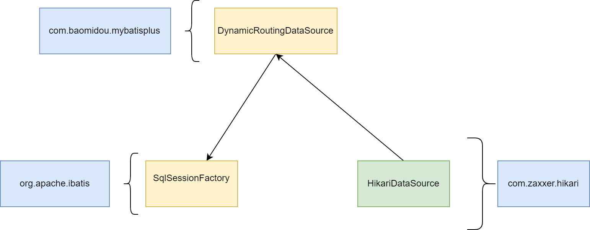

## 简述

mybatis-plus的动态数据源DynamicRoutingDataSource集成了mybatis的SqlSessionFactory和hikari的HikariDataSource。



## 源码解析


### DynamicDataSourceAutoConfiguration

dataSource()方法注册了DataSource类型的Bean，这个Bean的实现类是DynamicRoutingDataSource。当其他组件通过Spring自动注入DataSource类型的Bean的时候，实际上用的就是mybatis-plus提供的
DynamicRoutingDataSource。

ymlDynamicDataSourceProvider()方法注册了DynamicDataSourceProvider类型的Bean，这个Bean的实现类是YmlDynamicDataSourceProvider。DynamicRoutingDataSource加载多数据源的时候会使用到这个服务类。

```java
@Slf4j
@Configuration
@EnableConfigurationProperties(DynamicDataSourceProperties.class)
@AutoConfigureBefore(value = DataSourceAutoConfiguration.class, name = "com.alibaba.druid.spring.boot.autoconfigure.DruidDataSourceAutoConfigure")
@Import(value = {DruidDynamicDataSourceConfiguration.class, DynamicDataSourceCreatorAutoConfiguration.class})
@ConditionalOnProperty(prefix = DynamicDataSourceProperties.PREFIX, name = "enabled", havingValue = "true", matchIfMissing = true)
public class DynamicDataSourceAutoConfiguration implements InitializingBean {
    @Bean
    @ConditionalOnMissingBean
    public DataSource dataSource() {
        DynamicRoutingDataSource dataSource = new DynamicRoutingDataSource();
        //省略...
        return dataSource;
    }

    @Bean
    public DynamicDataSourceProvider ymlDynamicDataSourceProvider() {
        return new YmlDynamicDataSourceProvider(properties.getDatasource());
    }
}
```

### DynamicDataSourceCreatorAutoConfiguration

hikariDataSourceCreator()方法注册了HikariDataSourceCreator类型的bean，HikariDataSourceCreator实现了DataSourceCreator接口。

dataSourceCreator()方法注册为DefaultDataSourceCreator类型的bean，参数就是DataSourceCreator这个接口类型，实际注入的就是HikariDataSourceCreator。DefaultDataSourceCreator会使用
注入的DataSourceCreator进行数据源创建。

```java
    @ConditionalOnClass(HikariDataSource.class)
    @Configuration
    static class HikariDataSourceCreatorConfiguration {
        @Bean
        @Order(HIKARI_ORDER)
        public HikariDataSourceCreator hikariDataSourceCreator() {
            return new HikariDataSourceCreator();
        }
    }

    @Primary
    @Bean
    @ConditionalOnMissingBean
    public DefaultDataSourceCreator dataSourceCreator(List<DataSourceCreator> dataSourceCreators) {
        DefaultDataSourceCreator defaultDataSourceCreator = new DefaultDataSourceCreator();
        defaultDataSourceCreator.setCreators(dataSourceCreators);
        return defaultDataSourceCreator;
    }
```

### DynamicRoutingDataSource

DynamicRoutingDataSource实现了InitializingBean接口，其方法afterPropertiesSet()会在Spring容器完成Bean的属性注入之后调用。

DynamicRoutingDataSource 注入了DynamicDataSourceAutoConfiguration.ymlDynamicDataSourceProvider()注册的Bean，并且调用这个Bean的loadDataSources()方法获取数据源。并且将获取到的数据源
设置到dataSourceMap属性。除此之外，还会对数据源进行分组，设置到groupDataSources属性。

```java
@Slf4j
public class DynamicRoutingDataSource extends AbstractRoutingDataSource implements InitializingBean, DisposableBean {
    @Autowired
    private List<DynamicDataSourceProvider> providers;

    @Override
    public void afterPropertiesSet() throws Exception {
        // 检查开启了配置但没有相关依赖
        checkEnv();
        // 添加并分组数据源
        Map<String, DataSource> dataSources = new HashMap<>(16);
        for (DynamicDataSourceProvider provider : providers) {
            dataSources.putAll(provider.loadDataSources());
        }
        for (Map.Entry<String, DataSource> dsItem : dataSources.entrySet()) {
            addDataSource(dsItem.getKey(), dsItem.getValue());
        }
        // 检测默认数据源是否设置
        if (groupDataSources.containsKey(primary)) {
            log.info("dynamic-datasource initial loaded [{}] datasource,primary group datasource named [{}]", dataSources.size(), primary);
        } else if (dataSourceMap.containsKey(primary)) {
            log.info("dynamic-datasource initial loaded [{}] datasource,primary datasource named [{}]", dataSources.size(), primary);
        } else {
            log.warn("dynamic-datasource initial loaded [{}] datasource,Please add your primary datasource or check your configuration", dataSources.size());
        }
    }
}
```

### DynamicDataSourceProvider

YmlDynamicDataSourceProvider继承了AbstractDataSourceProvider抽象类，实现了DynamicDataSourceProvider接口。

YmlDynamicDataSourceProvider的loadDataSources()方法调用到了AbstractDataSourceProvider的createDataSourceMap()方法。AbstractDataSourceProvider又注入了DefaultDataSourceCreator属性。
前面说过，DefaultDataSourceCreator通过参数设置了HikariDataSourceCreator。最终创建数据源就来到了HikariDataSourceCreator

```java
@Slf4j
public abstract class AbstractDataSourceProvider implements DynamicDataSourceProvider {
    @Autowired
    private DefaultDataSourceCreator defaultDataSourceCreator;

    protected Map<String, DataSource> createDataSourceMap(
        Map<String, DataSourceProperty> dataSourcePropertiesMap) {
    Map<String, DataSource> dataSourceMap = new HashMap<>(dataSourcePropertiesMap.size() * 2);
    for (Map.Entry<String, DataSourceProperty> item : dataSourcePropertiesMap.entrySet()) {
        String dsName = item.getKey();
        DataSourceProperty dataSourceProperty = item.getValue();
        String poolName = dataSourceProperty.getPoolName();
        if (poolName == null || "".equals(poolName)) {
            poolName = dsName;
        }
        dataSourceProperty.setPoolName(poolName);
        dataSourceMap.put(dsName, defaultDataSourceCreator.createDataSource(dataSourceProperty));
    }
    return dataSourceMap;
}
}
```

### HikariDataSourceCreator

HikariDataSourceCreator的doCreateDataSource方法创建了HikariDataSource。

```java
@Override
    public DataSource doCreateDataSource(DataSourceProperty dataSourceProperty) {
        HikariConfig config = MERGE_CREATOR.create(gConfig, dataSourceProperty.getHikari());
        //省略。。。
        HikariDataSource dataSource = new HikariDataSource();
        //省略。。。
        return dataSource;
    }
```

### MybatisPlusAutoConfiguration

sqlSessionFactory方法注册了SqlSessionFactory类型的Bean，注入的DataSource就是DynamicDataSourceAutoConfiguration注册的DynamicRoutingDataSource类型的Bean

sqlSessionTemplate方法注册了SqlSessionTemplate类型的Bean，注入了SqlSessionFactory类型的Bean。

当调用sqlSessionTemplate执行SQL时，使用的数据源是DynamicRoutingDataSource，底层用就是HikariDataSource。

除了HikariDataSource，DynamicDataSourceCreatorAutoConfiguration还可以注册DruidDataSource，BeeDataSource，BasicDataSource等等。

```java
@Configuration(
    proxyBeanMethods = false
)
@ConditionalOnClass({SqlSessionFactory.class, SqlSessionFactoryBean.class})
@ConditionalOnSingleCandidate(DataSource.class)
@EnableConfigurationProperties({MybatisPlusProperties.class})
@AutoConfigureAfter({DataSourceAutoConfiguration.class, MybatisPlusLanguageDriverAutoConfiguration.class})
public class MybatisPlusAutoConfiguration implements InitializingBean {
    @Bean
    @ConditionalOnMissingBean
    public SqlSessionFactory sqlSessionFactory(DataSource dataSource) throws Exception {
        MybatisSqlSessionFactoryBean factory = new MybatisSqlSessionFactoryBean();
        factory.setDataSource(dataSource);
        // 省略
        return factory.getObject();
    }

    @Bean
    @ConditionalOnMissingBean
    public SqlSessionTemplate sqlSessionTemplate(SqlSessionFactory sqlSessionFactory) {
        ExecutorType executorType = this.properties.getExecutorType();
        return executorType != null ? new SqlSessionTemplate(sqlSessionFactory, executorType) : new SqlSessionTemplate(sqlSessionFactory);
    }
}
```
