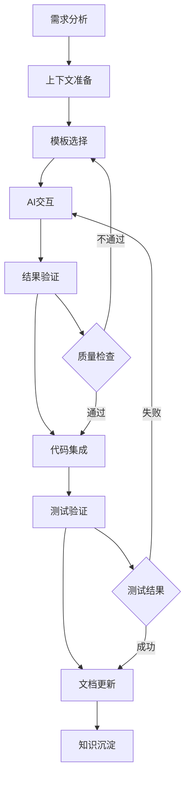

# Sprival AI辅助开发工作流程

## 概述

本文档定义了Sprival项目中AI辅助开发的标准工作流程，确保开发团队能够高效、一致地使用AI工具进行项目开发和维护。

## 工作流程概览



## 详细工作流程

### 1. 需求分析阶段

#### 1.1 需求收集
- **功能需求**: 明确要实现的具体功能
- **技术需求**: 确定技术栈和架构要求
- **质量需求**: 定义性能、安全、可维护性要求
- **约束条件**: 识别时间、资源、技术限制

#### 1.2 需求分类
```yaml
需求类型:
  新功能开发:
    - 组件集成
    - 业务功能
    - API接口
    - 配置管理
    
  问题修复:
    - Bug修复
    - 性能优化
    - 安全漏洞
    - 兼容性问题
    
  文档工作:
    - API文档
    - 使用指南
    - 配置说明
    - 部署文档
    
  代码审查:
    - 代码规范
    - 架构合理性
    - 安全检查
    - 性能评估
```

#### 1.3 优先级评估
- **紧急程度**: 高/中/低
- **重要程度**: 高/中/低
- **复杂程度**: 高/中/低
- **影响范围**: 全局/模块/局部

### 2. 上下文准备阶段

#### 2.1 自动化上下文生成
**第一步：运行上下文生成脚本**
```powershell
# 生成最新项目上下文
.\scripts\generate-project-context.ps1

# 查看生成的上下文文件
Get-Content docs\ai-development\context\sprival-ai-context-latest.md
```

**第二步：使用标准上下文模板**
```yaml
项目基础信息:
  - 项目名称: Sprival
  - 版本信息: 0.0.1
  - 技术栈: Spring Boot 2.7.18 + Java 8
  - 架构模式: 组件集成模板
  - 编码规范: UTF-8
  - 启动方式: mvn spring-boot:run 或 start-utf8.bat

当前状态:
  - 已完成组件: HTTP Server, MySQL, Redis, ClickHouse, MongoDB, RabbitMQ, Kafka, HTTP Client
  - 开发中组件: [根据实际情况更新]
  - 待开发组件: [根据需求规划]
  - 已知问题: [记录已知问题]
```

#### 2.2 上下文文件说明
- **sprival-ai-context-latest.md**: 综合项目上下文，AI编程的主要参考
- **component-status-latest.md**: 组件状态详情，了解各组件完成情况
- **ai-guidance-latest.md**: AI编程指导，包含开发规范和最佳实践
- **sprival-context-latest.json**: JSON格式上下文，供AI工具解析使用

#### 2.3 技术上下文收集
```yaml
相关组件:
  - 组件名称: [具体组件]
  - 版本信息: [版本号]
  - 配置状态: [配置情况]
  - 依赖关系: [依赖组件]
  - 健康检查: [健康检查实现]
  - 监控集成: [监控指标配置]

开发环境:
  - IDE配置: IntelliJ IDEA / Eclipse
  - 构建工具: Maven 3.8.9
  - 编码格式: UTF-8
  - 启动脚本: start-utf8.bat / start-utf8.ps1
  - 测试环境: [测试配置]
  - 部署环境: Docker + docker-compose
```

#### 2.4 业务上下文收集
```yaml
业务背景:
  - 业务领域: [具体领域]
  - 用户场景: [使用场景]
  - 业务规则: [业务约束]
  - 数据模型: [相关实体]

质量要求:
  - 性能指标: [具体指标]
  - 安全要求: [安全规范]
  - 可用性要求: [可用性指标]
  - 扩展性要求: [扩展需求]
```

### 3. 模板选择阶段

#### 3.1 模板分类选择
根据需求类型选择对应的模板类别：

```yaml
代码生成类:
  - 配置类生成: configuration-class.md
  - 服务类生成: service-class.md
  - 控制器生成: controller-class.md
  - 实体类生成: entity-class.md
  - 测试类生成: test-class.md

问题诊断类:
  - 错误分析: error-analysis.md
  - 性能优化: performance-optimization.md
  - 配置检查: configuration-check.md
  - 依赖冲突: dependency-conflict.md

文档生成类:
  - API文档: api-documentation.md
  - 配置说明: configuration-guide.md
  - 使用指南: user-guide.md
  - 部署文档: deployment-guide.md

代码审查类:
  - 代码规范检查: coding-standards.md
  - 安全性审查: security-review.md
  - 性能评估: performance-review.md
  - 架构合理性: architecture-review.md
```

#### 3.2 模板定制
- **变量替换**: 将上下文信息填入模板变量
- **内容补充**: 添加特定的需求和约束
- **格式调整**: 根据输出要求调整模板格式
- **示例准备**: 准备相关的代码示例和配置

### 4. AI交互阶段

#### 4.1 提示词构建
```markdown
## 标准提示词结构
1. **任务描述**: 明确具体要完成的任务
2. **项目上下文**: 提供完整的项目背景信息
3. **技术上下文**: 说明相关的技术栈和组件
4. **具体要求**: 详细的功能和质量要求
5. **输出格式**: 明确期望的输出格式和结构
6. **验证标准**: 提供结果验证的标准和方法
```

#### 4.2 交互策略
```yaml
单轮交互:
  适用场景: 简单的代码生成、配置修改
  特点: 一次性提供完整信息，获得最终结果
  
多轮交互:
  适用场景: 复杂问题诊断、架构设计
  特点: 逐步深入，迭代优化
  
并行交互:
  适用场景: 多个独立任务、批量处理
  特点: 同时处理多个相关任务
```

#### 4.3 质量控制
- **信息完整性**: 确保提供了足够的上下文信息
- **需求明确性**: 验证需求描述清晰、具体
- **约束条件**: 明确技术和业务约束
- **期望管理**: 设定合理的期望结果

### 5. 结果验证阶段

#### 5.1 验证维度
```yaml
功能正确性:
  - 功能实现完整
  - 逻辑正确无误
  - 边界条件处理
  - 异常情况处理

代码质量:
  - 编码规范遵循
  - 架构设计合理
  - 性能表现良好
  - 安全性考虑

可维护性:
  - 代码可读性
  - 文档完整性
  - 测试覆盖率
  - 扩展性设计

集成兼容性:
  - 与现有代码兼容
  - 依赖版本匹配
  - 配置项正确
  - 接口一致性
```

#### 5.2 验证方法
```yaml
静态检查:
  - 代码审查
  - 静态分析工具
  - 依赖检查
  - 配置验证

动态测试:
  - 单元测试
  - 集成测试
  - 功能测试
  - 性能测试

人工审查:
  - 架构审查
  - 业务逻辑审查
  - 安全审查
  - 用户体验审查
```

#### 5.3 问题处理
```yaml
质量问题分类:
  功能缺陷:
    - 重新明确需求
    - 补充上下文信息
    - 调整提示词

代码质量问题:
    - 添加质量约束
    - 提供代码规范
    - 增加示例参考

集成问题:
    - 检查依赖关系
    - 验证配置正确性
    - 测试集成点
```

### 6. 代码集成阶段

#### 6.1 集成准备
- **分支管理**: 创建功能分支进行开发
- **依赖检查**: 验证所需依赖已正确配置
- **环境准备**: 确保开发环境配置正确
- **备份策略**: 备份相关配置和数据

#### 6.2 代码集成
```yaml
集成步骤:
  1. 代码合并: 将AI生成的代码合并到项目中
  2. 配置更新: 更新相关配置文件
  3. 依赖解决: 解决可能的依赖冲突
  4. 编译验证: 确保代码能够正常编译

集成检查:
  - 编译通过
  - 静态检查通过
  - 基本功能验证
  - 配置项生效
```

#### 6.3 冲突解决
```yaml
常见冲突类型:
  代码冲突:
    - 方法签名冲突
    - 类名冲突
    - 包结构冲突
    
  配置冲突:
    - 属性名冲突
    - 配置值冲突
    - 组件冲突
    
  依赖冲突:
    - 版本冲突
    - 传递依赖冲突
    - 类加载冲突
```

### 7. 测试验证阶段

#### 7.1 测试策略
```yaml
测试层级:
  单元测试:
    - 覆盖核心逻辑
    - 边界条件测试
    - 异常情况测试
    
  集成测试:
    - 组件间集成
    - 数据库集成
    - 外部服务集成
    
  系统测试:
    - 端到端功能测试
    - 性能测试
    - 安全测试
```

#### 7.2 测试执行
```bash
# 单元测试
mvn test

# 集成测试
mvn integration-test

# 代码覆盖率
mvn jacoco:report

# 静态代码分析
mvn sonar:sonar
```

#### 7.3 测试结果处理
```yaml
测试通过:
  - 记录测试结果
  - 更新测试文档
  - 进入下一阶段

测试失败:
  - 分析失败原因
  - 确定修复策略
  - 返回对应阶段
```

### 8. 文档更新阶段

#### 8.1 文档类型
```yaml
技术文档:
  - API文档更新
  - 配置说明更新
  - 架构文档更新
  - 部署文档更新

用户文档:
  - 使用指南更新
  - 功能说明更新
  - 常见问题更新
  - 最佳实践更新

开发文档:
  - 代码注释完善
  - 设计文档更新
  - 变更日志记录
  - 测试文档更新
```

#### 8.2 文档更新流程
```yaml
文档审查:
  - 内容准确性检查
  - 格式规范性检查
  - 完整性检查
  - 一致性检查

文档发布:
  - 版本控制提交
  - 文档网站更新
  - 团队通知
  - 用户通知
```

### 9. 知识沉淀阶段

#### 9.1 经验总结
```yaml
成功案例:
  - 问题描述
  - 解决方案
  - 关键要点
  - 适用场景

失败教训:
  - 问题原因
  - 错误做法
  - 正确做法
  - 预防措施
```

#### 9.2 知识库更新
```yaml
模板优化:
  - 模板内容完善
  - 变量定义优化
  - 示例更新
  - 使用说明改进

流程改进:
  - 流程步骤优化
  - 检查点完善
  - 工具集成
  - 效率提升

最佳实践:
  - 成功模式总结
  - 常见问题解决
  - 工具使用技巧
  - 团队协作经验
```

## 工作流程实施指南

### 1. 团队角色定义

#### 开发者角色
- **需求分析**: 理解和分析开发需求
- **上下文准备**: 收集和整理相关信息
- **AI交互**: 使用AI工具进行开发
- **结果验证**: 验证AI输出的质量
- **代码集成**: 将结果集成到项目中

#### 架构师角色
- **架构审查**: 审查AI生成的架构设计
- **技术决策**: 指导技术选型和设计决策
- **质量把控**: 确保代码和设计质量
- **最佳实践**: 制定和推广最佳实践

#### 测试工程师角色
- **测试策略**: 制定测试计划和策略
- **测试执行**: 执行各级别的测试
- **质量评估**: 评估功能和性能质量
- **问题反馈**: 反馈发现的问题

### 2. 工具集成

#### 开发工具集成
```yaml
IDE集成:
  - AI插件配置
  - 代码模板集成
  - 自动补全优化
  - 代码审查工具

构建工具集成:
  - Maven插件配置
  - 代码质量检查
  - 自动化测试
  - 文档生成

版本控制集成:
  - Git工作流
  - 代码审查流程
  - 自动化部署
  - 变更追踪
```

#### 监控工具集成
```yaml
质量监控:
  - 代码质量指标
  - 测试覆盖率
  - 性能指标
  - 安全扫描

流程监控:
  - 开发效率指标
  - AI使用效果
  - 问题解决时间
  - 知识积累情况
```

### 3. 持续改进

#### 流程优化
```yaml
定期评估:
  - 流程效率评估
  - 工具使用效果
  - 团队满意度
  - 质量改进情况

持续改进:
  - 流程步骤优化
  - 工具功能增强
  - 培训内容更新
  - 最佳实践推广
```

#### 知识管理
```yaml
知识收集:
  - 成功案例收集
  - 问题解决方案
  - 最佳实践总结
  - 工具使用技巧

知识分享:
  - 团队内部分享
  - 文档知识库
  - 培训课程
  - 社区贡献
```

## 质量保证措施

### 1. 检查清单

#### 需求分析检查清单
- [ ] 需求描述清晰完整
- [ ] 技术约束明确
- [ ] 质量要求具体
- [ ] 验收标准明确

#### 上下文准备检查清单
- [ ] 项目信息完整
- [ ] 技术栈信息准确
- [ ] 相关组件状态最新
- [ ] 业务背景清楚

#### AI交互检查清单
- [ ] 模板选择合适
- [ ] 提示词结构完整
- [ ] 上下文信息充分
- [ ] 输出要求明确

#### 结果验证检查清单
- [ ] 功能实现正确
- [ ] 代码质量良好
- [ ] 集成兼容性好
- [ ] 文档完整准确

### 2. 风险控制

#### 常见风险及应对
```yaml
技术风险:
  AI输出错误:
    - 多重验证机制
    - 人工审查确认
    - 测试充分验证
    
  集成冲突:
    - 充分的集成测试
    - 分阶段集成
    - 回滚方案准备

流程风险:
  需求理解偏差:
    - 需求澄清机制
    - 多方确认
    - 原型验证
    
  质量控制不足:
    - 多层次质量检查
    - 自动化质量检测
    - 人工质量审查

项目风险:
  进度延期:
    - 合理的时间估算
    - 风险缓冲时间
    - 并行开发策略
    
  团队协作问题:
    - 清晰的角色分工
    - 有效的沟通机制
    - 定期的团队同步
```

## 成效评估

### 1. 评估指标

#### 效率指标
- **开发速度**: 功能实现时间对比
- **代码质量**: 缺陷密度、代码复杂度
- **文档质量**: 文档完整性、准确性
- **知识积累**: 可复用组件、模板数量

#### 质量指标
- **功能质量**: 需求满足度、用户满意度
- **技术质量**: 性能指标、安全性、可维护性
- **过程质量**: 流程遵循度、问题解决效率

### 2. 持续优化

#### 数据收集
- 开发过程数据记录
- 质量指标定期统计
- 团队反馈收集
- 用户使用反馈

#### 分析改进
- 定期数据分析
- 问题根因分析
- 改进措施制定
- 效果跟踪验证

---

*本工作流程将根据项目发展和团队实践持续优化完善*
