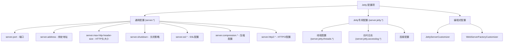

# jetty配置详细说明

## 1. 概述

Spring Boot 提供了丰富的 Jetty 配置选项，包括通过配置文件的声明式配置和通过代码的编程式配置。本文档详细介绍了所有可用的配置项和使用方法。

## 2. 配置项分类



## 3. Jetty 专用配置项 (`server.jetty.*`)

### 3.1 线程池配置 (`server.jetty.threads.*`)

```yaml
server:
  jetty:
    threads:
      # 最大线程数 (默认: 200)
      max: 200
      # 最小线程数 (默认: 8)
      min: 8
      # 线程空闲超时时间 (默认: 60秒)
      idle-timeout: 60000ms
      # 线程池队列最大容量
      max-queue-capacity: 512
      # Acceptor 线程数 (-1 表示自动)
      acceptors: -1
      # Selector 线程数 (-1 表示自动)
      selectors: -1
```

### 3.2 连接配置

```yaml
server:
  jetty:
    # HTTP POST 表单最大大小 (默认: 200KB)
    max-http-form-post-size: 200KB
    # 连接空闲超时时间
    connection-idle-timeout: 30s
```

### 3.3 访问日志配置 (`server.jetty.accesslog.*`)

```yaml
server:
  jetty:
    accesslog:
      # 启用访问日志
      enabled: true
      # 日志文件名 (默认: yyyy_mm_dd.request.log)
      filename: access.log
      # 日志文件目录
      file-date-format: yyyy_MM_dd
      # 是否保留旧日志文件
      retain-days: 31
      # 是否追加到现有文件
      append: true
      # 扩展日志格式 (NCSA 或 EXTENDED_NCSA)
      format: EXTENDED_NCSA
      # 忽略的路径
      ignore-paths:
        - /health
        - /actuator/*
```

## 4. 通用服务器配置

```yaml
server:
  # 端口配置
  port: 8080
  # 绑定地址
  address: 0.0.0.0
  # HTTP 头最大大小
  max-http-header-size: 8KB
  # 服务器响应头
  server-header: MyApp/1.0
  # 关闭策略 (IMMEDIATE 或 GRACEFUL)
  shutdown: GRACEFUL
  # 转发头策略
  forward-headers-strategy: NATIVE
```

## 5. SSL 配置

```yaml
server:
  ssl:
    # 启用 SSL
    enabled: true
    # 密钥库路径
    key-store: classpath:keystore.jks
    # 密钥库密码
    key-store-password: secret
    # 密钥库类型
    key-store-type: JKS
    # 密钥别名
    key-alias: tomcat
    # 信任库配置
    trust-store: classpath:truststore.jks
    trust-store-password: secret
    # 客户端认证
    client-auth: need
    # 启用的协议
    enabled-protocols: TLSv1.2,TLSv1.3
    # 启用的密码套件
    ciphers: TLS_ECDHE_RSA_WITH_AES_128_GCM_SHA256
```

## 6. HTTP/2 配置

```yaml
server:
  http2:
    # 启用 HTTP/2
    enabled: true
```

## 7. 压缩配置

```yaml
server:
  compression:
    # 启用压缩
    enabled: true
    # 压缩的 MIME 类型
    mime-types: text/html,text/xml,text/plain,text/css,application/json
    # 最小压缩大小
    min-response-size: 1024
```

## 8. 编程式配置

### 8.1 理解 `ObjectProvider<JettyServerCustomizer> serverCustomizers` 参数

在 `ServletWebServerFactoryConfiguration.EmbeddedJetty` 类中：

```java
@Bean
JettyServletWebServerFactory jettyServletWebServerFactory(
        ObjectProvider<JettyServerCustomizer> serverCustomizers) {
    JettyServletWebServerFactory factory = new JettyServletWebServerFactory();
    factory.getServerCustomizers().addAll(
        serverCustomizers.orderedStream().collect(Collectors.toList())
    );
    return factory;
}
```

**`ObjectProvider<T>` 的作用：**
- **可选性**：即使容器中没有对应类型的 Bean，也不会报错
- **延迟获取**：只有在实际使用时才会从容器中获取 Bean
- **集合操作**：可以获取容器中所有符合条件的 Bean
- **有序性**：支持通过 `@Order` 控制自定义器的执行顺序

**工作流程：**
1. **收集自定义器**：`serverCustomizers.orderedStream()` 获取容器中所有的 `JettyServerCustomizer` Bean
2. **按顺序排列**：根据 `@Order` 注解或 `Ordered` 接口排序
3. **添加到工厂**：将这些自定义器添加到 `JettyServletWebServerFactory` 中
4. **应用自定义**：在创建 Jetty 服务器时，逐一调用这些自定义器

### 8.2 使用 `JettyServerCustomizer`

```java
@Component
@Order(1)
public class CustomJettyConfig implements JettyServerCustomizer {
    
    @Override
    public void customize(Server server) {
        // 配置服务器停止超时
        server.setStopTimeout(30000);
        
        // 添加自定义连接器
        ServerConnector connector = new ServerConnector(server);
        connector.setPort(8081);
        connector.setHost("localhost");
        server.addConnector(connector);
        
        // 配置线程池
        QueuedThreadPool threadPool = new QueuedThreadPool();
        threadPool.setMaxThreads(300);
        threadPool.setMinThreads(10);
        server.setThreadPool(threadPool);
        
        // 添加统计处理器
        StatisticsHandler stats = new StatisticsHandler();
        stats.setHandler(server.getHandler());
        server.setHandler(stats);
    }
}
```

### 8.3 使用 `WebServerFactoryCustomizer`

```java
@Component
public class JettyCustomizer implements WebServerFactoryCustomizer<JettyServletWebServerFactory> {
    
    @Override
    public void customize(JettyServletWebServerFactory factory) {
        // 设置线程池
        factory.setThreadPool(createCustomThreadPool());
        
        // 添加服务器自定义器
        factory.addServerCustomizers(server -> {
            // 配置 HTTP 配置
            for (Connector connector : server.getConnectors()) {
                if (connector instanceof ServerConnector) {
                    ServerConnector serverConnector = (ServerConnector) connector;
                    for (ConnectionFactory factory : serverConnector.getConnectionFactories()) {
                        if (factory instanceof HttpConnectionFactory) {
                            HttpConnectionFactory httpFactory = (HttpConnectionFactory) factory;
                            HttpConfiguration httpConfig = httpFactory.getHttpConfiguration();
                            
                            // 配置请求头大小
                            httpConfig.setRequestHeaderSize(16384);
                            // 配置响应头大小
                            httpConfig.setResponseHeaderSize(16384);
                            // 配置输出缓冲区大小
                            httpConfig.setOutputBufferSize(32768);
                        }
                    }
                }
            }
        });
        
        // 添加 Jetty 配置
        factory.addConfigurations(new WebInfConfiguration());
    }
    
    private ThreadPool createCustomThreadPool() {
        QueuedThreadPool threadPool = new QueuedThreadPool();
        threadPool.setMaxThreads(200);
        threadPool.setMinThreads(8);
        threadPool.setIdleTimeout(60000);
        return threadPool;
    }
}
```

## 9. 高级配置示例

### 9.1 配置自定义错误页面

```java
@Component
public class ErrorPageCustomizer implements JettyServerCustomizer {
    
    @Override
    public void customize(Server server) {
        ErrorHandler errorHandler = new ErrorHandler();
        errorHandler.setShowStacks(false);
        errorHandler.setShowMessageInTitle(false);
        server.addBean(errorHandler);
    }
}
```

### 9.2 配置 WebSocket

```java
@Component
public class WebSocketCustomizer implements JettyServerCustomizer {
    
    @Override
    public void customize(Server server) {
        // 配置 WebSocket
        ServletContextHandler context = (ServletContextHandler) server.getHandler();
        
        // 添加 WebSocket 支持
        ServerContainer wsContainer = WebSocketServerContainerInitializer.configure(context, null);
        wsContainer.setDefaultMaxTextMessageBufferSize(64 * 1024);
        wsContainer.setDefaultMaxBinaryMessageBufferSize(64 * 1024);
    }
}
```

### 9.3 配置安全头

```java
@Component
public class SecurityHeaderCustomizer implements JettyServerCustomizer {
    
    @Override
    public void customize(Server server) {
        // 添加安全头
        server.addBean(new HeaderHandler() {
            @Override
            public void handle(String target, Request baseRequest, 
                             HttpServletRequest request, HttpServletResponse response) 
                             throws IOException, ServletException {
                
                response.setHeader("X-Frame-Options", "DENY");
                response.setHeader("X-Content-Type-Options", "nosniff");
                response.setHeader("X-XSS-Protection", "1; mode=block");
                
                super.handle(target, baseRequest, request, response);
            }
        });
    }
}
```

## 10. 完整配置示例

```yaml
# application.yml
server:
  port: 8080
  address: 0.0.0.0
  max-http-header-size: 16KB
  shutdown: GRACEFUL
  
  # Jetty 专用配置
  jetty:
    # 线程池配置
    threads:
      max: 300
      min: 10
      idle-timeout: 30s
      max-queue-capacity: 1000
      acceptors: 2
      selectors: 4
    
    # 连接配置
    max-http-form-post-size: 2MB
    connection-idle-timeout: 60s
    
    # 访问日志
    accesslog:
      enabled: true
      filename: jetty-access.log
      format: EXTENDED_NCSA
      retain-days: 30
      ignore-paths:
        - /actuator/health
        - /favicon.ico
  
  # SSL 配置
  ssl:
    enabled: true
    key-store: classpath:keystore.p12
    key-store-password: ${SSL_KEYSTORE_PASSWORD:changeit}
    key-store-type: PKCS12
    key-alias: jetty
  
  # HTTP/2 支持
  http2:
    enabled: true
  
  # 压缩配置
  compression:
    enabled: true
    mime-types: text/html,text/xml,text/plain,text/css,application/json,application/javascript
    min-response-size: 2KB
```

## 11. 配置项总结表

| 配置项 | 默认值 | 说明 |
|--------|--------|------|
| `server.jetty.threads.max` | 200 | 最大线程数 |
| `server.jetty.threads.min` | 8 | 最小线程数 |
| `server.jetty.threads.idle-timeout` | 60s | 线程空闲超时 |
| `server.jetty.threads.acceptors` | -1 | Acceptor 线程数 |
| `server.jetty.threads.selectors` | -1 | Selector 线程数 |
| `server.jetty.max-http-form-post-size` | 200KB | POST 表单最大大小 |
| `server.jetty.connection-idle-timeout` | 无 | 连接空闲超时 |
| `server.jetty.accesslog.enabled` | false | 启用访问日志 |
| `server.jetty.accesslog.filename` | yyyy_mm_dd.request.log | 访问日志文件名 |
| `server.jetty.accesslog.format` | NCSA | 日志格式 |
| `server.jetty.accesslog.retain-days` | 31 | 日志保留天数 |


## 12. 最佳实践

1. **简单配置**：优先使用 `application.yml` 中的属性配置
2. **复杂配置**：使用 `JettyServerCustomizer` 进行编程式配置
3. **工厂配置**：使用 `WebServerFactoryCustomizer` 进行更底层的配置

