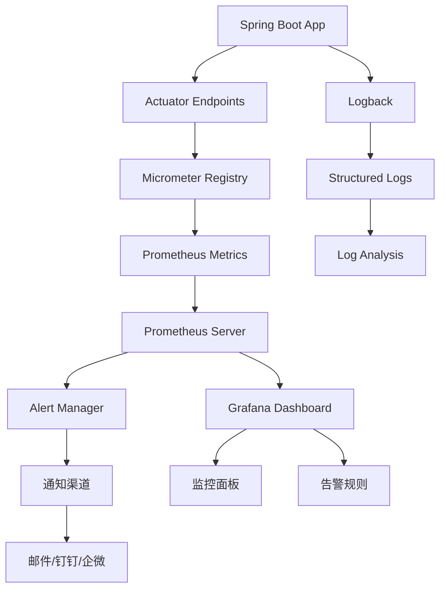

# Spring 监控模块

## 概述

Spring 监控模块提供了完整的应用监控解决方案，包括指标收集、健康检查、告警配置和可视化展示。该模块基于现代化的监控技术栈，为Sprival项目提供全方位的运维支持。

## 核心特性

- ✅ **多维度监控**: 应用性能、数据库连接池、JVM内存、系统资源
- ✅ **实时告警**: 基于Prometheus + AlertManager的智能告警
- ✅ **可视化展示**: Grafana仪表板和实时监控面板
- ✅ **健康检查**: 多层级健康状态检测和故障自愈
- ✅ **日志监控**: 结构化日志收集和分析
- ✅ **性能分析**: 应用性能瓶颈识别和优化建议

## 监控架构

### 技术栈
- **Spring Boot Actuator**: 应用健康检查和指标暴露
- **Micrometer**: 指标收集和格式化
- **Prometheus**: 指标存储和查询
- **Grafana**: 可视化展示和告警
- **AlertManager**: 告警路由和通知
- **Logback**: 结构化日志输出

### 架构图


## Actuator配置

### 基础配置
```properties
# 启用所有监控端点
management.endpoints.web.exposure.include = *

# 启用Prometheus指标导出
management.metrics.export.prometheus.enabled = true

# 自定义Actuator端点路径
management.endpoints.web.base-path = /actuator

# 健康检查详细信息
management.endpoint.health.show-details = always
management.endpoint.health.show-components = always

# 应用信息配置
management.info.env.enabled = true
management.info.build.enabled = true
management.info.git.enabled = true
```

### 高级配置
```properties
# JVM指标配置
management.metrics.enable.jvm = true
management.metrics.enable.process = true
management.metrics.enable.system = true

# Web指标配置
management.metrics.web.server.request.autotime.enabled = true
management.metrics.web.client.request.autotime.enabled = true

# 数据源指标配置
management.metrics.enable.hikaricp = true
management.metrics.enable.jdbc = true

# 自定义指标标签
management.metrics.tags.application = sprival
management.metrics.tags.environment = ${spring.profiles.active:dev}
management.metrics.tags.version = @project.version@
```

## 核心监控指标

### 1. 应用性能指标
```properties
# JVM内存指标
jvm.memory.used                   # 已使用内存
jvm.memory.committed              # 已提交内存
jvm.memory.max                    # 最大内存
jvm.gc.pause                      # GC暂停时间
jvm.gc.memory.allocated           # GC分配的内存
jvm.gc.memory.promoted            # GC晋升的内存

# HTTP请求指标
http.server.requests              # HTTP请求统计
http.server.requests.active       # 当前活跃请求数

# 系统指标
system.cpu.usage                  # CPU使用率
system.load.average.1m            # 1分钟平均负载
process.uptime                    # 应用运行时间
```

### 2. 数据库监控指标
```properties
# HikariCP连接池监控指标
hikaricp.connections              # 当前连接数
hikaricp.connections.acquire      # 连接获取时间分布
hikaricp.connections.active       # 活跃连接数
hikaricp.connections.creation     # 连接创建时间分布
hikaricp.connections.idle         # 空闲连接数
hikaricp.connections.max          # 最大连接数配置
hikaricp.connections.min          # 最小连接数配置
hikaricp.connections.pending      # 等待获取连接的线程数
hikaricp.connections.timeout      # 连接获取超时次数
hikaricp.connections.usage        # 连接使用时间分布
```

### 3. 自定义业务指标
```java
@Component
public class BusinessMetrics {
    
    private final MeterRegistry meterRegistry;
    private final Counter requestCounter;
    private final Timer responseTimer;
    private final Gauge activeUsersGauge;
    
    public BusinessMetrics(MeterRegistry meterRegistry) {
        this.meterRegistry = meterRegistry;
        
        // 请求计数器
        this.requestCounter = Counter.builder("business.requests.total")
            .description("Total number of business requests")
            .tag("service", "sprival")
            .register(meterRegistry);
            
        // 响应时间统计
        this.responseTimer = Timer.builder("business.response.duration")
            .description("Business response duration")
            .tag("service", "sprival")
            .register(meterRegistry);
    }
    
    // 记录业务请求
    public void recordRequest(String operation, Duration duration) {
        requestCounter.increment(Tags.of("operation", operation));
        responseTimer.record(duration);
    }
}
```

## 健康检查配置

### 多层级健康检查
```java
@Component
public class CompositeHealthIndicator implements HealthIndicator {
    
    @Autowired
    private List<HealthIndicator> healthIndicators;
    
    @Override
    public Health health() {
        Health.Builder builder = new Health.Builder();
        Map<String, Object> details = new HashMap<>();
        boolean allHealthy = true;
        
        for (HealthIndicator indicator : healthIndicators) {
            try {
                Health health = indicator.health();
                String name = indicator.getClass().getSimpleName();
                details.put(name, health.getStatus().getCode());
                
                if (health.getStatus() != Status.UP) {
                    allHealthy = false;
                }
            } catch (Exception e) {
                details.put("error", e.getMessage());
                allHealthy = false;
            }
        }
        
        return allHealthy ? 
            builder.up().withDetails(details).build() :
            builder.down().withDetails(details).build();
    }
}
```

### 自定义健康检查
```java
@Component
public class CustomHealthIndicator implements HealthIndicator {
    
    @Override
    public Health health() {
        // 检查外部服务连接
        if (checkExternalService()) {
            return Health.up()
                .withDetail("external-service", "Available")
                .withDetail("timestamp", System.currentTimeMillis())
                .build();
        } else {
            return Health.down()
                .withDetail("external-service", "Unavailable")
                .withDetail("timestamp", System.currentTimeMillis())
                .build();
        }
    }
    
    private boolean checkExternalService() {
        // 实际的健康检查逻辑
        return true;
    }
}
```

## Prometheus配置

### Prometheus服务配置 (prometheus.yml)
```yaml
global:
  scrape_interval: 15s
  evaluation_interval: 15s
  external_labels:
    cluster: 'sprival-cluster'
    replica: 'prometheus-1'

rule_files:
  - "sprival-alerts.yml"
  - "business-alerts.yml"

scrape_configs:
  - job_name: 'sprival-app'
    static_configs:
      - targets: ['localhost:8338']
    metrics_path: '/api/actuator/prometheus'
    scrape_interval: 10s
    scrape_timeout: 10s
    
  - job_name: 'sprival-database'
    static_configs:
      - targets: ['localhost:3306']
    metrics_path: '/metrics'
    scrape_interval: 30s
    
alerting:
  alertmanagers:
    - static_configs:
        - targets:
          - alertmanager:9093
```

### 告警规则配置 (sprival-alerts.yml)
```yaml
groups:
  - name: sprival-application
    rules:
      # 应用健康检查失败告警
      - alert: ApplicationDown
        expr: up{job="sprival-app"} == 0
        for: 30s
        labels:
          severity: critical
          service: sprival
          team: backend
        annotations:
          summary: "Sprival应用服务不可用"
          description: "应用已停止响应超过30秒"
          runbook_url: "https://wiki.company.com/sprival/runbook"
          
      # 应用响应时间过长告警
      - alert: HighResponseTime
        expr: histogram_quantile(0.95, http_server_requests_seconds) > 2
        for: 2m
        labels:
          severity: warning
          service: sprival
        annotations:
          summary: "应用响应时间过长"
          description: "95%的请求响应时间超过2秒: {{ $value }}s"
          
  - name: sprival-database
    rules:
      # 数据库连接池使用率告警
      - alert: HighDatabaseConnectionUsage
        expr: (hikaricp_connections_active / hikaricp_connections_max) * 100 > 80
        for: 2m
        labels:
          severity: warning
          service: sprival
          component: database
        annotations:
          summary: "数据库连接池使用率过高"
          description: "连接池使用率 {{ $value }}% 超过80%阈值"
          
      # 数据库连接获取时间告警
      - alert: SlowDatabaseConnection
        expr: histogram_quantile(0.95, hikaricp_connections_acquire_seconds) > 1
        for: 1m
        labels:
          severity: critical
          service: sprival
          component: database
        annotations:
          summary: "数据库连接获取时间过长"
          description: "95%的连接获取时间超过1秒: {{ $value }}s"
          
  - name: sprival-system
    rules:
      # JVM内存使用率告警
      - alert: HighJVMMemoryUsage
        expr: (jvm_memory_used_bytes{area="heap"} / jvm_memory_max_bytes{area="heap"}) * 100 > 85
        for: 2m
        labels:
          severity: warning
          service: sprival
          component: jvm
        annotations:
          summary: "JVM堆内存使用率过高"
          description: "堆内存使用率 {{ $value }}% 超过85%阈值"
          
      # GC时间过长告警
      - alert: LongGCPause
        expr: increase(jvm_gc_pause_seconds{quantile="0.95"}[5m]) > 1
        for: 1m
        labels:
          severity: warning
          service: sprival
          component: jvm
        annotations:
          summary: "GC暂停时间过长"
          description: "95%的GC暂停时间超过1秒"
          
      # CPU使用率过高告警
      - alert: HighCPUUsage
        expr: system_cpu_usage * 100 > 80
        for: 5m
        labels:
          severity: warning
          service: sprival
          component: system
        annotations:
          summary: "系统CPU使用率过高"
          description: "CPU使用率 {{ $value }}% 超过80%阈值"
```

## Grafana仪表板

### 应用监控面板
```json
{
  "dashboard": {
    "id": null,
    "title": "Sprival Application Monitoring",
    "tags": ["sprival", "monitoring"],
    "timezone": "browser",
    "panels": [
      {
        "id": 1,
        "title": "应用状态概览",
        "type": "stat",
        "gridPos": {"h": 8, "w": 12, "x": 0, "y": 0},
        "targets": [
          {
            "expr": "up{job=\"sprival-app\"}",
            "legendFormat": "应用状态"
          }
        ],
        "fieldConfig": {
          "defaults": {
            "mappings": [
              {"options": {"0": {"text": "DOWN"}}, "type": "value"},
              {"options": {"1": {"text": "UP"}}, "type": "value"}
            ],
            "thresholds": {
              "steps": [
                {"color": "red", "value": 0},
                {"color": "green", "value": 1}
              ]
            }
          }
        }
      },
      {
        "id": 2,
        "title": "JVM内存使用情况",
        "type": "timeseries",
        "gridPos": {"h": 8, "w": 12, "x": 12, "y": 0},
        "targets": [
          {
            "expr": "jvm_memory_used_bytes{area=\"heap\"}",
            "legendFormat": "堆内存使用"
          },
          {
            "expr": "jvm_memory_max_bytes{area=\"heap\"}",
            "legendFormat": "堆内存最大值"
          }
        ]
      },
      {
        "id": 3,
        "title": "HTTP请求统计",
        "type": "timeseries",
        "gridPos": {"h": 8, "w": 24, "x": 0, "y": 8},
        "targets": [
          {
            "expr": "rate(http_server_requests_seconds_count[5m])",
            "legendFormat": "请求速率 (req/sec)"
          }
        ]
      },
      {
        "id": 4,
        "title": "数据库连接池状态",
        "type": "timeseries",
        "gridPos": {"h": 8, "w": 24, "x": 0, "y": 16},
        "targets": [
          {
            "expr": "hikaricp_connections_active",
            "legendFormat": "活跃连接"
          },
          {
            "expr": "hikaricp_connections_idle",
            "legendFormat": "空闲连接"
          },
          {
            "expr": "hikaricp_connections_pending",
            "legendFormat": "等待连接"
          }
        ]
      }
    ],
    "time": {
      "from": "now-1h",
      "to": "now"
    },
    "refresh": "30s"
  }
}
```

## 日志监控

### Logback配置
```xml
<!-- logback-spring.xml -->
<configuration>
    <springProfile name="!local">
        <!-- 生产环境JSON格式日志 -->
        <appender name="STDOUT" class="ch.qos.logback.core.ConsoleAppender">
            <encoder class="net.logstash.logback.encoder.LoggingEventCompositeJsonEncoder">
                <providers>
                    <timestamp/>
                    <version/>
                    <logLevel/>
                    <message/>
                    <mdc/>
                    <arguments/>
                    <stackTrace/>
                </providers>
            </encoder>
        </appender>
    </springProfile>
    
    <!-- 应用日志 -->
    <appender name="FILE" class="ch.qos.logback.core.rolling.RollingFileAppender">
        <file>logs/sprival.log</file>
        <rollingPolicy class="ch.qos.logback.core.rolling.TimeBasedRollingPolicy">
            <fileNamePattern>logs/sprival.%d{yyyy-MM-dd}.%i.log</fileNamePattern>
            <maxFileSize>100MB</maxFileSize>
            <maxHistory>30</maxHistory>
            <totalSizeCap>10GB</totalSizeCap>
        </rollingPolicy>
        <encoder class="net.logstash.logback.encoder.LoggingEventCompositeJsonEncoder">
            <providers>
                <timestamp/>
                <logLevel/>
                <loggerName/>
                <message/>
                <mdc/>
                <arguments/>
                <stackTrace/>
            </providers>
        </encoder>
    </appender>
    
    <!-- 性能监控日志 -->
    <appender name="PERF" class="ch.qos.logback.core.rolling.RollingFileAppender">
        <file>logs/performance.log</file>
        <rollingPolicy class="ch.qos.logback.core.rolling.TimeBasedRollingPolicy">
            <fileNamePattern>logs/performance.%d{yyyy-MM-dd}.log</fileNamePattern>
            <maxHistory>7</maxHistory>
        </rollingPolicy>
        <encoder>
            <pattern>%d{yyyy-MM-dd HH:mm:ss.SSS} [%thread] %-5level %logger{36} - %msg%n</pattern>
        </encoder>
    </appender>
    
    <!-- 错误日志 -->
    <appender name="ERROR" class="ch.qos.logback.core.rolling.RollingFileAppender">
        <file>logs/error.log</file>
        <filter class="ch.qos.logback.classic.filter.LevelFilter">
            <level>ERROR</level>
            <onMatch>ACCEPT</onMatch>
            <onMismatch>DENY</onMismatch>
        </filter>
        <rollingPolicy class="ch.qos.logback.core.rolling.TimeBasedRollingPolicy">
            <fileNamePattern>logs/error.%d{yyyy-MM-dd}.log</fileNamePattern>
            <maxHistory>90</maxHistory>
        </rollingPolicy>
        <encoder>
            <pattern>%d{yyyy-MM-dd HH:mm:ss.SSS} [%thread] %-5level %logger{36} - %msg%n</pattern>
        </encoder>
    </appender>
    
    <!-- 特定组件日志配置 -->
    <logger name="com.soyokra.sprival" level="INFO" additivity="false">
        <appender-ref ref="FILE"/>
        <appender-ref ref="ERROR"/>
    </logger>
    
    <logger name="performance" level="INFO" additivity="false">
        <appender-ref ref="PERF"/>
    </logger>
    
    <root level="INFO">
        <appender-ref ref="STDOUT"/>
        <appender-ref ref="FILE"/>
        <appender-ref ref="ERROR"/>
    </root>
</configuration>
```

## AlertManager配置

### 告警路由配置
```yaml
global:
  smtp_smarthost: 'smtp.company.com:587'
  smtp_from: 'alerts@company.com'

route:
  group_by: ['alertname', 'severity', 'service']
  group_wait: 30s
  group_interval: 5m
  repeat_interval: 12h
  receiver: 'default'
  routes:
    - match:
        severity: critical
      receiver: 'critical-alerts'
      group_wait: 10s
      repeat_interval: 5m
    - match:
        service: sprival
      receiver: 'sprival-team'

receivers:
  - name: 'default'
    email_configs:
      - to: 'devops@company.com'
        subject: '[ALERT] {{ .GroupLabels.service }} - {{ .GroupLabels.alertname }}'
        body: |
          {{ range .Alerts }}
          Alert: {{ .Annotations.summary }}
          Description: {{ .Annotations.description }}
          {{ end }}
          
  - name: 'critical-alerts'
    email_configs:
      - to: 'oncall@company.com'
        subject: '[CRITICAL] {{ .GroupLabels.service }} - {{ .GroupLabels.alertname }}'
    webhook_configs:
      - url: 'http://dingtalk-webhook/alert'
        send_resolved: true
        
  - name: 'sprival-team'
    email_configs:
      - to: 'sprival-team@company.com'
        subject: '[Sprival] {{ .GroupLabels.alertname }}'

inhibit_rules:
  - source_match:
      severity: 'critical'
    target_match:
      severity: 'warning'
    equal: ['alertname', 'service']
```

## 监控最佳实践

### 1. 指标命名规范
```properties
# 业务指标命名
business.{module}.{operation}.{metric_type}
# 示例：business.user.login.total

# 技术指标命名
tech.{component}.{metric_name}
# 示例：tech.database.connection.active
```

### 2. 告警级别定义
- **Critical**: 影响服务可用性，需要立即处理
- **Warning**: 可能影响性能，需要关注
- **Info**: 信息性告警，用于趋势分析

### 3. 监控数据保留策略
```yaml
# Prometheus数据保留
retention.time: 30d
storage.tsdb.retention.size: 50GB

# Grafana数据源配置
datasource.prometheus.timeout: 60s
datasource.prometheus.max_concurrent_queries: 20
```

## 运维指南

### 监控系统健康检查
```bash
#!/bin/bash
# monitoring-health-check.sh

echo "=== 监控系统健康检查 ==="

# 1. 检查Prometheus
echo "1. Prometheus状态检查..."
curl -f http://localhost:9090/-/healthy && echo "✅ Prometheus正常" || echo "❌ Prometheus异常"

# 2. 检查Grafana
echo "2. Grafana状态检查..."
curl -f http://localhost:3000/api/health && echo "✅ Grafana正常" || echo "❌ Grafana异常"

# 3. 检查AlertManager
echo "3. AlertManager状态检查..."
curl -f http://localhost:9093/-/healthy && echo "✅ AlertManager正常" || echo "❌ AlertManager异常"

# 4. 检查应用监控端点
echo "4. 应用监控端点检查..."
curl -f http://localhost:8338/api/actuator/health && echo "✅ 应用监控正常" || echo "❌ 应用监控异常"

echo "=== 检查完成 ==="
```

### 监控故障排查
```bash
# 常用排查命令
# 查看Prometheus目标状态
curl http://localhost:9090/api/v1/targets

# 查看告警规则状态
curl http://localhost:9090/api/v1/rules

# 查看当前活跃告警
curl http://localhost:9090/api/v1/alerts

# 查看指标数据
curl "http://localhost:9090/api/v1/query?query=up"
```

## 部署配置

### Docker Compose部署
```yaml
version: '3.8'

services:
  prometheus:
    image: prom/prometheus:latest
    container_name: prometheus
    ports:
      - "9090:9090"
    volumes:
      - ./prometheus.yml:/etc/prometheus/prometheus.yml
      - ./alerts:/etc/prometheus/alerts
    command:
      - '--config.file=/etc/prometheus/prometheus.yml'
      - '--storage.tsdb.path=/prometheus'
      - '--web.console.libraries=/etc/prometheus/console_libraries'
      - '--web.console.templates=/etc/prometheus/consoles'
      - '--web.enable-lifecycle'
      
  grafana:
    image: grafana/grafana:latest
    container_name: grafana
    ports:
      - "3000:3000"
    environment:
      - GF_SECURITY_ADMIN_PASSWORD=admin
    volumes:
      - grafana-storage:/var/lib/grafana
      - ./grafana/dashboards:/etc/grafana/provisioning/dashboards
      - ./grafana/datasources:/etc/grafana/provisioning/datasources
      
  alertmanager:
    image: prom/alertmanager:latest
    container_name: alertmanager
    ports:
      - "9093:9093"
    volumes:
      - ./alertmanager.yml:/etc/alertmanager/alertmanager.yml

volumes:
  grafana-storage:
```

通过这个全面的监控模块，您可以：
1. **全方位监控**应用性能和系统状态
2. **实时告警**关键指标异常
3. **可视化展示**监控数据和趋势
4. **自动化运维**监控系统健康检查
5. **标准化部署**容器化监控环境
