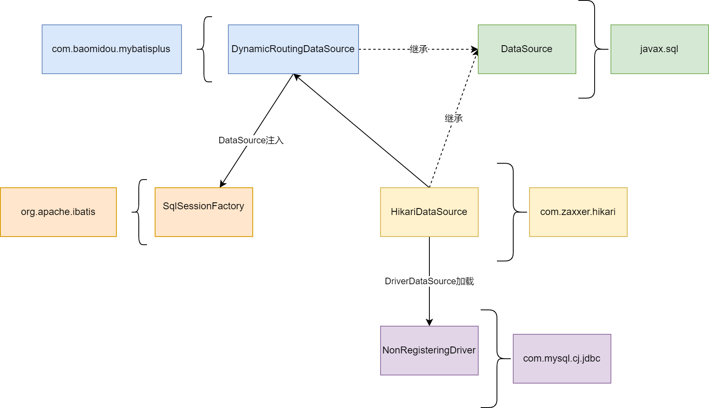

# spring-mysql

## 组件
- [mybatis-plus](./mybatis-plus/README.md)
- [jdbc](./jdbc/README.md)
- [mybatis](./mybatis/README.md)
- [hikari](./hikari/README.md)
- [p6spy](./p6spy/README.md)

## 配置说明
数据库连接配置
```yml
spring.datasource.dynamic.datasource.primary = master # 默认库

# 主库
spring.datasource.dynamic.datasource.master.username = root
spring.datasource.dynamic.datasource.master.password = workdock
spring.datasource.dynamic.datasource.master.url = jdbc:mysql://localhost:3306/sprival
spring.datasource.dynamic.datasource.master.driver-class-name = com.mysql.jdbc.Driver
spring.datasource.dynamic.datasource.master.type = com.zaxxer.hikari.HikariDataSource #使用Hikaricp

# 从库
spring.datasource.dynamic.datasource.slave.username = root
spring.datasource.dynamic.datasource.slave.password = workdock
spring.datasource.dynamic.datasource.slave.url = jdbc:mysql://localhost:3306/sprival
spring.datasource.dynamic.datasource.slave.driver-class-name = com.mysql.jdbc.Driver
spring.datasource.dynamic.datasource.slave.type = com.zaxxer.hikari.HikariDataSource #使用Hikaricp
```

hikari线程池配置
```yml
## hikari全局配置
spring.datasource.dynamic.hikari.is-auto-commit =  true
spring.datasource.dynamic.hikari.max_lifetime = 30000
spring.datasource.dynamic.hikari.min_idle = 10
spring.datasource.dynamic.hikari.max_pool_size = 1000
spring.datasource.dynamic.hikari.idle_timeout = 10000
spring.datasource.dynamic.hikari.connection_timeout = 10000
spring.datasource.dynamic.hikari.validation_timeout = 1000
spring.datasource.dynamic.hikari.connection_init_sql = set session wait_timeout=28800,interactive_timeout=28800;

## hikari指定数据库配置
spring.datasource.dynamic.datasource.master.hikari.is-auto-commit =  true
spring.datasource.dynamic.datasource.master.hikari.max_lifetime = 30000
spring.datasource.dynamic.datasource.master.hikari.min_idle = 10
spring.datasource.dynamic.datasource.master.hikari.max_pool_size = 1000
spring.datasource.dynamic.datasource.master.hikari.idle_timeout = 10000
spring.datasource.dynamic.datasource.master.hikari.connection_timeout = 10000
spring.datasource.dynamic.datasource.master.hikari.validation_timeout = 1000
spring.datasource.dynamic.datasource.master.hikari.connection_init_sql = set session wait_timeout=28800,interactive_timeout=28800;
```

hikari线程池配置说明
- autoCommit: 事务自动提交，默认值TRUE
- connectionTimeout: 从连接池拿连接的超时时长, 最小值250毫秒，默认30秒
- idleTimeout：空闲连接超时时间，超过最小空闲连接数的连接空闲保持的存活的时长，单位毫秒，最小值10秒， 默认值10分钟
- maxLifetime：最小空闲连接保持存活的最大时长，这个值应该小于数据库允许客户端连接存活的最大时长，单位毫秒，最小值30秒，默认值30分钟
- connectionTestQuery：用于驱动不支持JDBC4 连接检查Connection.isValid()接口，用于心跳检查
- minimumIdle：最小空闲连接，默认值和maximumPoolSize。建议和maximumPoolSize一样，作为固定连接池使用
- maximumPoolSize：最大连接数，应用请求超过最大连接数的时候，会等待connectionTimeout再抛出异常

> 最小空闲连接：假设minimumIdle=10，maximumPoolSize=15，应用一直占用10个连接，那么hikari会参试创建10个空闲连接，但是受到最大连接数限制，只会创建5个空闲连接
> 假设应用释放了这个10个连接，由于最小空闲连接数是10个，hikari会关掉5个空闲连接

参考文档：[https://github.com/brettwooldridge/HikariCP/tree/HikariCP-3.4.5](https://github.com/brettwooldridge/HikariCP/tree/HikariCP-3.4.5)


## 监控设置
mybatis-plus集成hikari配置micrometer组件采集监控指标需要处理一下，具体参见源码
```text
SprivalHikariDataSourceCreator
SprivalHikariDataSourceCreatorAutoConfiguration
```

访问http://127.0.0.1/api/actuator/metrics就能看到hikaricp的指标

```text
    "hikaricp.connections",
    "hikaricp.connections.acquire",
    "hikaricp.connections.active",
    "hikaricp.connections.creation",
    "hikaricp.connections.idle",
    "hikaricp.connections.max",
    "hikaricp.connections.min",
    "hikaricp.connections.pending",
    "hikaricp.connections.timeout",
    "hikaricp.connections.usage",
```


## 源码分析
mybatis-plus自动装配实现了对mybatis和hikari的集成。

mybatis-plus的DynamicRoutingDataSource继承自DataSource，并且注册了mybatis的SqlSessionFactory Bean，
注入的实例就是DynamicRoutingDataSource。因此使用mybatis执行sql的时候，实际上 使用的是mybatis-plus的DynamicRoutingDataSource

如果选择hikari作为DataSource，mybatis-plus会将HikariDataSource注入到DynamicRoutingDataSource，使用到连接池的时候，会引用HikariDataSource。

hikari通过DriverDataSource加载驱动，进而使用到对应厂商jdbc的实现类

