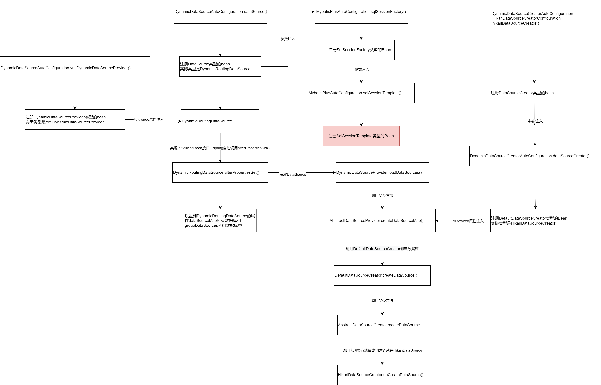

# Datasource

mybatis-plus的动态数据源DynamicRoutingDataSource集成了mybatis的SqlSessionFactory和hikari的HikariDataSource。


## 源码解析




### 创建DataSource
主要的调用路线如下

```text
DataSource(DynamicRoutingDataSource)
   --> DynamicDataSourceProvider(YmlDynamicDataSourceProvider)--> AbstractDataSourceProvider  
           --> DataSourceCreator(HikariDataSourceCreator) --> AbstractDataSourceCreator
               --> HikariDataSourceCreator.HikariDataSource
```

#### DataSource(DynamicRoutingDataSource)
DynamicDataSourceAutoConfiguration自动装配将DynamicRoutingDataSource类注册为DataSource接口类型的Bean到Spring容器

DynamicRoutingDataSource的afterPropertiesSet方法通过DynamicDataSourceProvider接口的loadDataSources方法，创建更底层的数据源dataSourceMap
```java
public class DynamicDataSourceAutoConfiguration implements InitializingBean {
    @Bean
    @ConditionalOnMissingBean
    public DataSource dataSource() {
        DynamicRoutingDataSource dataSource = new DynamicRoutingDataSource();
        //省略...
        return dataSource;
    }

    @Bean
    public DynamicDataSourceProvider ymlDynamicDataSourceProvider() {
        return new YmlDynamicDataSourceProvider(properties.getDatasource());
    }
}

@Slf4j
public class DynamicRoutingDataSource extends AbstractRoutingDataSource implements InitializingBean, DisposableBean {
    @Autowired
    private List<DynamicDataSourceProvider> providers;
    /**
     * 所有数据库
     */
    private final Map<String, DataSource> dataSourceMap = new ConcurrentHashMap<>();

    @Override
    public void afterPropertiesSet() throws Exception {
        // 检查开启了配置但没有相关依赖
        checkEnv();
        // 添加并分组数据源
        Map<String, DataSource> dataSources = new HashMap<>(16);
        for (DynamicDataSourceProvider provider : providers) {
            dataSources.putAll(provider.loadDataSources());
        }
        for (Map.Entry<String, DataSource> dsItem : dataSources.entrySet()) {
            addDataSource(dsItem.getKey(), dsItem.getValue());
        }
        // 检测默认数据源是否设置
        if (groupDataSources.containsKey(primary)) {
            log.info("dynamic-datasource initial loaded [{}] datasource,primary group datasource named [{}]", dataSources.size(), primary);
        } else if (dataSourceMap.containsKey(primary)) {
            log.info("dynamic-datasource initial loaded [{}] datasource,primary datasource named [{}]", dataSources.size(), primary);
        } else {
            log.warn("dynamic-datasource initial loaded [{}] datasource,Please add your primary datasource or check your configuration", dataSources.size());
        }
    }
}
```


#### DynamicDataSourceProvider(YmlDynamicDataSourceProvider)
DynamicDataSourceAutoConfiguration自动装配将YmlDynamicDataSourceProvider类注册为DynamicDataSourceProvider接口类型的Bean到Spring容器

YmlDynamicDataSourceProvider通过其父类AbstractDataSourceProvider的createDataSourceMap方法调用到DefaultDataSourceCreator接口的createDataSource方法创建数据源
```java
public class DynamicDataSourceAutoConfiguration implements InitializingBean {
    @Bean
    public DynamicDataSourceProvider ymlDynamicDataSourceProvider() {
        return new YmlDynamicDataSourceProvider(properties.getDatasource());
    }
}

public class YmlDynamicDataSourceProvider extends AbstractDataSourceProvider {
    
    @Override
    public Map<String, DataSource> loadDataSources() {
        return createDataSourceMap(dataSourcePropertiesMap);
    }
}

@Slf4j
public abstract class AbstractDataSourceProvider implements DynamicDataSourceProvider {
    @Autowired
    private DefaultDataSourceCreator defaultDataSourceCreator;

    protected Map<String, DataSource> createDataSourceMap(
            Map<String, DataSourceProperty> dataSourcePropertiesMap) {
        Map<String, DataSource> dataSourceMap = new HashMap<>(dataSourcePropertiesMap.size() * 2);
        for (Map.Entry<String, DataSourceProperty> item : dataSourcePropertiesMap.entrySet()) {
            String dsName = item.getKey();
            DataSourceProperty dataSourceProperty = item.getValue();
            String poolName = dataSourceProperty.getPoolName();
            if (poolName == null || "".equals(poolName)) {
                poolName = dsName;
            }
            dataSourceProperty.setPoolName(poolName);
            dataSourceMap.put(dsName, defaultDataSourceCreator.createDataSource(dataSourceProperty));
        }
        return dataSourceMap;
    }
}
```

#### DefaultDataSourceCreator(HikariDataSourceCreator)

DynamicDataSourceCreatorAutoConfiguration自动装配将HikariDataSourceCreator类注册为DataSourceCreator接口类型的Bean到Spring容器

注意这里一个列表，意味着可以有多个DataSourceCreator的实现

DefaultDataSourceCreator会先调用其父类AbstractDataSourceCreator的createDataSource方法，进而调用wrapDataSource实现p6spay的包裹

```java
public class DynamicDataSourceCreatorAutoConfiguration {
    @ConditionalOnClass(HikariDataSource.class)
    @Configuration
    static class HikariDataSourceCreatorConfiguration {
        @Bean
        @Order(HIKARI_ORDER)
        public HikariDataSourceCreator hikariDataSourceCreator() {
            return new HikariDataSourceCreator();
        }
    }

    @Primary
    @Bean
    @ConditionalOnMissingBean
    public DefaultDataSourceCreator dataSourceCreator(List<DataSourceCreator> dataSourceCreators) {
        DefaultDataSourceCreator defaultDataSourceCreator = new DefaultDataSourceCreator();
        defaultDataSourceCreator.setCreators(dataSourceCreators);
        return defaultDataSourceCreator;
    }
}

@Slf4j
public abstract class AbstractDataSourceCreator implements DataSourceCreator {
    @Override
    public DataSource createDataSource(DataSourceProperty dataSourceProperty) {
        String publicKey = dataSourceProperty.getPublicKey();
        if (StringUtils.isEmpty(publicKey)) {
            publicKey = properties.getPublicKey();
            dataSourceProperty.setPublicKey(publicKey);
        }
        Boolean lazy = dataSourceProperty.getLazy();
        if (lazy == null) {
            lazy = properties.getLazy();
            dataSourceProperty.setLazy(lazy);
        }
        dataSourceInitEvent.beforeCreate(dataSourceProperty);
        DataSource dataSource = doCreateDataSource(dataSourceProperty);
        dataSourceInitEvent.afterCreate(dataSource);
        this.runScrip(dataSource, dataSourceProperty);
        return wrapDataSource(dataSource, dataSourceProperty);
    }

    private DataSource wrapDataSource(DataSource dataSource, DataSourceProperty dataSourceProperty) {
        String name = dataSourceProperty.getPoolName();
        DataSource targetDataSource = dataSource;

        Boolean enabledP6spy = properties.getP6spy() && dataSourceProperty.getP6spy();
        if (enabledP6spy) {
            targetDataSource = new P6DataSource(dataSource);
            log.debug("dynamic-datasource [{}] wrap p6spy plugin", name);
        }

        Boolean enabledSeata = properties.getSeata() && dataSourceProperty.getSeata();
        SeataMode seataMode = properties.getSeataMode();
        if (enabledSeata) {
            if (SeataMode.XA == seataMode) {
                targetDataSource = new DataSourceProxyXA(targetDataSource);
            } else {
                targetDataSource = new DataSourceProxy(targetDataSource);
            }
            log.debug("dynamic-datasource [{}] wrap seata plugin transaction mode ", name);
        }
        return new ItemDataSource(name, dataSource, targetDataSource, enabledP6spy, enabledSeata, seataMode);
    }
}
```

#### HikariDataSourceCreator
HikariDataSourceCreator负责创建HikariDataSource
```java
public class HikariDataSourceCreator extends AbstractDataSourceCreator implements DataSourceCreator, InitializingBean {
    @Override
    public DataSource doCreateDataSource(DataSourceProperty dataSourceProperty) {
        HikariConfig config = MERGE_CREATOR.create(gConfig, dataSourceProperty.getHikari());
        //省略。。。
        HikariDataSource dataSource = new HikariDataSource();
        //省略。。。
        return dataSource;
    }

}


```

#### DriverDataSource
hikari的DriverDataSource类构造方法加载指定的JDBC实现作为操作数据库的驱动
```java
package com.zaxxer.hikari.util;

public final class DriverDataSource implements DataSource {
    public DriverDataSource(String jdbcUrl, String driverClassName, Properties properties, String username, String password)
    {
        this.jdbcUrl = jdbcUrl;
        this.driverProperties = new Properties();

        for (Entry<Object, Object> entry : properties.entrySet()) {
            driverProperties.setProperty(entry.getKey().toString(), entry.getValue().toString());
        }

        if (username != null) {
            driverProperties.put(USER, driverProperties.getProperty("user", username));
        }
        if (password != null) {
            driverProperties.put(PASSWORD, driverProperties.getProperty("password", password));
        }

        if (driverClassName != null) {
            Enumeration<Driver> drivers = DriverManager.getDrivers();
            while (drivers.hasMoreElements()) {
                Driver d = drivers.nextElement();
                if (d.getClass().getName().equals(driverClassName)) {
                    driver = d;
                    break;
                }
            }

            if (driver == null) {
                LOGGER.warn("Registered driver with driverClassName={} was not found, trying direct instantiation.", driverClassName);
                Class<?> driverClass = null;
                ClassLoader threadContextClassLoader = Thread.currentThread().getContextClassLoader();
                try {
                    if (threadContextClassLoader != null) {
                        try {
                            driverClass = threadContextClassLoader.loadClass(driverClassName);
                            LOGGER.debug("Driver class {} found in Thread context class loader {}", driverClassName, threadContextClassLoader);
                        }
                        catch (ClassNotFoundException e) {
                            LOGGER.debug("Driver class {} not found in Thread context class loader {}, trying classloader {}",
                                    driverClassName, threadContextClassLoader, this.getClass().getClassLoader());
                        }
                    }

                    if (driverClass == null) {
                        driverClass = this.getClass().getClassLoader().loadClass(driverClassName);
                        LOGGER.debug("Driver class {} found in the HikariConfig class classloader {}", driverClassName, this.getClass().getClassLoader());
                    }
                } catch (ClassNotFoundException e) {
                    LOGGER.debug("Failed to load driver class {} from HikariConfig class classloader {}", driverClassName, this.getClass().getClassLoader());
                }

                if (driverClass != null) {
                    try {
                        driver = (Driver) driverClass.newInstance();
                    } catch (Exception e) {
                        LOGGER.warn("Failed to create instance of driver class {}, trying jdbcUrl resolution", driverClassName, e);
                    }
                }
            }
        }

        final String sanitizedUrl = jdbcUrl.replaceAll("([?&;]password=)[^&#;]*(.*)", "$1<masked>$2");
        try {
            if (driver == null) {
                driver = DriverManager.getDriver(jdbcUrl);
                LOGGER.debug("Loaded driver with class name {} for jdbcUrl={}", driver.getClass().getName(), sanitizedUrl);
            }
            else if (!driver.acceptsURL(jdbcUrl)) {
                throw new RuntimeException("Driver " + driverClassName + " claims to not accept jdbcUrl, " + sanitizedUrl);
            }
        }
        catch (SQLException e) {
            throw new RuntimeException("Failed to get driver instance for jdbcUrl=" + sanitizedUrl, e);
        }
    }
}
```


### DataSource注入SqlSessionFactory

主要的调用路线如下
```text
SqlSessionTemplate --> SqlSessionFactory --> DataSource(DynamicRoutingDataSource)
```

自动装配注册了SqlSessionFactory类型的Bean，注入的DataSource就是DynamicRoutingDataSource

自动装配注册了SqlSessionTemplate类型的Bean，其方法注入了SqlSessionFactory

当调用sqlSessionTemplate执行SQL时，使用的数据源是DynamicRoutingDataSource，底层用就是HikariDataSource。

除了HikariDataSource，DynamicDataSourceCreatorAutoConfiguration还可以注册DruidDataSource，BeeDataSource，BasicDataSource等等。

```java
@Configuration(
    proxyBeanMethods = false
)
@ConditionalOnClass({SqlSessionFactory.class, SqlSessionFactoryBean.class})
@ConditionalOnSingleCandidate(DataSource.class)
@EnableConfigurationProperties({MybatisPlusProperties.class})
@AutoConfigureAfter({DataSourceAutoConfiguration.class, MybatisPlusLanguageDriverAutoConfiguration.class})
public class MybatisPlusAutoConfiguration implements InitializingBean {
    @Bean
    @ConditionalOnMissingBean
    public SqlSessionFactory sqlSessionFactory(DataSource dataSource) throws Exception {
        MybatisSqlSessionFactoryBean factory = new MybatisSqlSessionFactoryBean();
        factory.setDataSource(dataSource);
        // 省略
        return factory.getObject();
    }

    @Bean
    @ConditionalOnMissingBean
    public SqlSessionTemplate sqlSessionTemplate(SqlSessionFactory sqlSessionFactory) {
        ExecutorType executorType = this.properties.getExecutorType();
        return executorType != null ? new SqlSessionTemplate(sqlSessionFactory, executorType) : new SqlSessionTemplate(sqlSessionFactory);
    }
}
```

